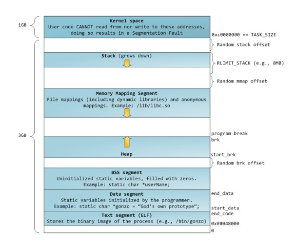

### **Работа с памятью в C++**

---

#### **1. Архитектура памяти процесса**

**Виртуальное адресное пространство:**
- Каждый процесс имеет изолированное адресное пространство
- Преобразование виртуальных адресов в физические через **Page Table**
- Сегменты памяти располагаются в определенных областях


**Распространенные layout-ы:**
- **Linux**: 3GB пользовательское пространство + 1GB ядро
- **Windows**: 2GB пользовательское пространство + 2GB ядро

---

#### **2. Сегменты памяти процесса**


**Основные сегменты:**
- **Text (Code)**: исполняемый код программы
- **Data**: инициализированные глобальные переменные
- **BSS**: неинициализированные глобальные переменные (заполняются нулями)
- **Heap**: динамическая память (растет вверх)
- **Stack**: локальные переменные, аргументы функций (растет вниз)
- **Memory Mapping**: загруженные библиотеки, mmap-файлы

---

#### **3. Стек вызовов (Call Stack)**

**Структура стекового кадра:**
```
|----------------------|
| Локальные переменные |  ← нижние адреса
|----------------------|
| Сохраненный EBP      |
|----------------------|
| Адрес возврата       |
|----------------------|
| Аргументы функции    |  ← верхние адреса
|----------------------|
```

**Ключевые регистры:**
- **RSP/ESP**: указатель вершины стека
- **RBP/EBP**: указатель базового кадра
- **RAX/EAX**: возвращаемое значение

**Когда использовать:**
- Небольшие данные (< 1KB)
- Короткоживущие объекты
- Локальные переменные функций

---

#### **4. Динамическая память (Куча)**

**Зачем нужна:**
- Большие объемы данных
- Динамические структуры (растущие массивы)
- Объекты, живущие дольше функции

**Функции C:**
```cpp
#include <stdlib>

int main() {
    // Выделение памяти
    int* single = (int*)malloc(sizeof(int)); // выделение памяти для 1 инта
    int* array = (int*)calloc(10, sizeof(int));  // инициализируется нулями, в отличие от malloc с мусором внутри
    
    if (single && array) {
	    // Код выполнится только если оба указателя не NULL
        *single = 42;
        array[0] = 100;
        
        // Изменение размера
        array = (int*)realloc(array, 20 * sizeof(int)); // новые элементы содержат мусор!
    }
    
    // Освобождение памяти
    free(single);
    free(array);
    
    return 0;
}
```

**Операторы C++:**
```cpp
int main() {
    // Одиночные объекты
    int* ptr = new int(42); // выделяется 4 байта на интовую переменную - в нее кладется 42
    delete ptr; // освобождает память выделенную с помощью new
    
    // Массивы
    int* arr = new int[100]; // выделение 4 * 100 байт памяти (содержит мусор)
    delete[] arr;  // важно использовать delete[] для массивов
    
    // Современный C++ - умные указатели (рекомендуется)
    auto smart_ptr = std::make_unique<int[]>(100);
    // автоматическое освобождение при выходе из области видимости
    
    return 0;
}
```

**Важные правила:**
- Каждому `malloc`/`new` должен соответствовать `free`/`delete`
- `free(nullptr)`/`delete nullptr` безопасны
- После освобождения устанавливайте указатель в `nullptr`

---

#### **5. Распространенные ошибки памяти**

**Segmentation Fault причины:**
```cpp
// 1. Разыменование нулевого указателя
int* ptr = nullptr;
*ptr = 42;  // SIGSEGV

// 2. Доступ к освобожденной памяти
int* data = new int[10];
delete[] data;
data[0] = 1;  // использование после освобождения

// 3. Запись в read-only память
char* str = "constant";  // строковый литерал в text segment
str[0] = 'X';  // попытка модификации

// 4. Выход за границы массива
int arr[10];
arr[100] = 5;  // stack overflow или повреждение соседних данных

// 5. Переполнение стека
void recursive() {
    int large_array[1000000];  // слишком большой для стека
    recursive();               // бесконечная рекурсия
}
```

**Stack Overflow пример:**
```cpp
int main() {
    uint64_t huge_array[1048576];  // 8MB на стеке - слишком много
    return 0;
}
```

**Правильная работа со строками:**
```cpp
int main() {
    // НЕПРАВИЛЬНО - попытка модификации литерала
    // char* str = "Hello";  
    // str[0] = 'h';  // SIGSEGV
    
    // ПРАВИЛЬНО - массив можно модифицировать
    char str[] = "Hello";
    str[0] = 'h';  // OK
    
    return 0;
}
```

